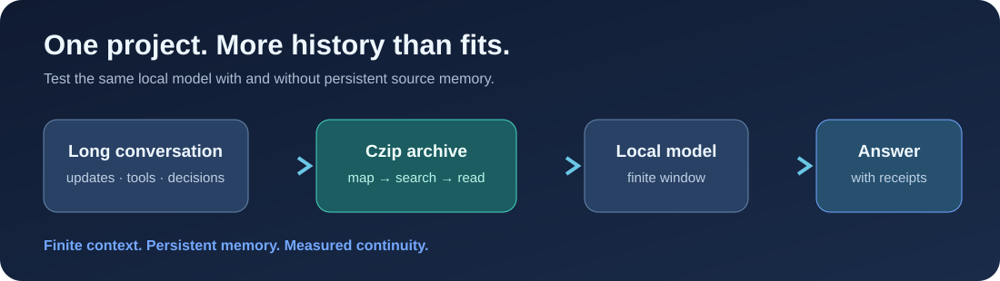
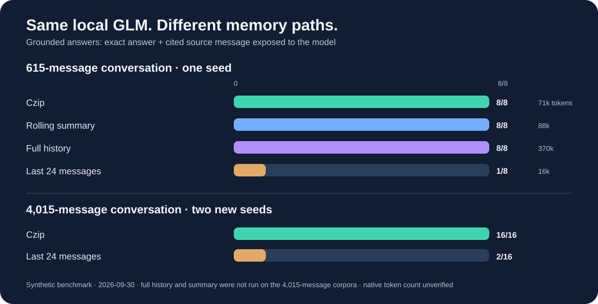

# Czip Continuity Gauntlet

[](https://github.com/Jilazem/czip-continuity-gauntlet/actions/workflows/ci.yml)

### What happens when one local model's project conversation keeps growing?



**One model. One long project. Four ways to remember it.** This repository
tests whether [Czip](https://github.com/Jilazem/Czip) can help a local model
recover the *right* fact, decision, and source from a growing engineering
conversation. It measures the **model plus memory system**, not the model's
native context length.

> A good result is not “I found a secret string.” It is “I found the current
> decision, rejected its obsolete version, and can show the original message.”

## Verified local run



On `GLM-5.3-Flash-EXL3`, the 615-message run scored **8/8** for Czip,
rolling summary, and full history, and **1/8** for the last-24-message
control. Czip used **71,243 prompt tokens** across the eight questions;
full history used **369,536**. The summary used **88,171 including 26
preparation calls**. On two more 4,015-message seeds, Czip scored **16/16**
and the recent-message control **2/16**. The large histories have about
**1.24 million characters** each; their exact GLM token count was not
available. See the [full run notes and per-question JSON traces](results/2026-09-30/README.md).

These are small, synthetic runs of one model and one template. The summary
matched Czip's accuracy at the 615-message scale. The chart does not show
summary or full-history scores at 4,015 messages because those arms were
not run there.

## What the gauntlet asks

The deterministic generator creates one logical ORION project conversation.
It interleaves routine work with eight checks:

| Challenge | Failure it catches |
|---|---|
| Early exact fact | Losing a decision buried near the beginning |
| Superseded region | Repeating an obsolete value |
| Revoked fallback | Violating a later user instruction |
| Reopened incident | Mistaking a past closure for current status |
| Two-hop escalation | Finding one clue but failing to join two records |
| Tool-output evidence | Ignoring an important tool result |
| Approval boundary | Assigning a user-only action to the assistant |
| Unknown PIN | Guessing a fact that was never provided |

Each answer has a short exact target and source message indices. **Grounded
accuracy** counts only answers that are correct, cite all required sources,
and expose those sources to the answering model. A Czip search snippet alone
does not count as reading the source.

## The comparison

All arms use the **same OpenAI-compatible local chat endpoint**, model,
temperature (`0`), questions, and generated history.

| Arm | Memory available at question time |
|---|---|
| `czip` | Small Czip map, then up to six model-chosen `search`/`read` actions against a full HKP1 pack |
| `summary` | Rolling handoff note made by the same model as messages arrive, capped at 4,000 characters |
| `tail` | Last 24 messages only |
| `full` | Every message in the prompt, when the model server accepts it |

The `tail` arm is a basic finite-window control; `summary` is the more useful
compaction baseline. The optional `full` arm is an upper-bound comparison,
not a competitor that remains feasible as the history grows. Other retrieval
systems can use the same test; passing it is not exclusive to Czip.

## Quick start

Python 3.9+ is enough for this harness. Czip is loaded from a **separate local
checkout**; no Czip source code or private session data is bundled here.

```bash
git clone https://github.com/Jilazem/Czip.git
git clone https://github.com/Jilazem/czip-continuity-gauntlet.git
cd czip-continuity-gauntlet

python bench.py generate --seed 20260930 --filler-per-gap 60 --output data/public-seed.json
python bench.py run --dataset data/public-seed.json --out-dir runs/local-01 \
  --czip-source ../Czip --base-url http://127.0.0.1:8000/v1 \
  --model YOUR_LOCAL_MODEL --arms czip summary tail

# Inspect runs/local-01/report.md and runs/local-01/results.json
```

The default generator makes **615 messages and 8 probes**. Increase
`--filler-per-gap` to stress larger histories. Use several seeds, including
ones held back until the method is frozen, for any public comparison.

For a server that requires a bearer token, set `CZCG_API_KEY` in your shell.
The harness never prints the key. The endpoint may be local or remote, but
the **local-only** claim applies only if the configured endpoint stays local
and does not route requests elsewhere.

For GLM servers that support `chat_template_kwargs`, add
`--disable-thinking` to keep the finite output budget for the final JSON
answer. Use the same setting for every arm and disclose it in the report.

Windows PowerShell uses the same Python commands; put each `python` command
on one line or use PowerShell's backtick for line continuation.

## What a result means

The report includes raw correctness, grounded correctness, retrieval calls,
input characters, latency, and API token usage when the server supplies it.
Errors and rejected overlength prompts remain in the denominator. The JSON
also keeps each model/tool trace for auditing. Publish dataset and engine
hashes, model/build details, arm settings, and unknown hardware or context
settings alongside any percentage.

Run the local checks:

```bash
python -m unittest discover -s tests -v
```

See [PROTOCOL.md](PROTOCOL.md) for fairness rules and reporting requirements.

## Relationship to existing benchmarks

[LongMemEval](https://github.com/xiaowu0162/LongMemEval) evaluates long-term
assistant memory, including updates, temporal reasoning, and abstention.
[LoCoMo](https://github.com/snap-research/locomo) supplies long conversational
QA and event tasks. [InfiniteBench](https://github.com/OpenBMB/InfiniteBench)
tests very long input contexts. This gauntlet focuses on **project continuity
with searchable source evidence**, using a small, fully generated test that
anyone can inspect and rerun. It is not a replacement for those datasets.

## Important limits

- The conversation and answers are synthetic. Publish results across several
  seeds and real, consented project histories before generalizing.
- Each question is a fresh API call after the same logical project history.
  This tests carryover and retrieval, not a literally unreset model process.
- Czip's full pack can be much larger than the model window. The model still
  has a finite window, and retrieval can miss relevant evidence.
- The rolling summary arm spends model calls during ingestion. Its setup cost
  is reported separately and must be included in any cost comparison.
- `--full` Czip packing is used so archive truncation cannot explain a miss.
- This harness does not test Hermes/Codex plugin UI behavior, production
  persistence, or sensitive-data handling.

Harness code: MIT. Czip itself has its own license; see the
[Czip license](https://github.com/Jilazem/Czip/blob/main/LICENSE).
